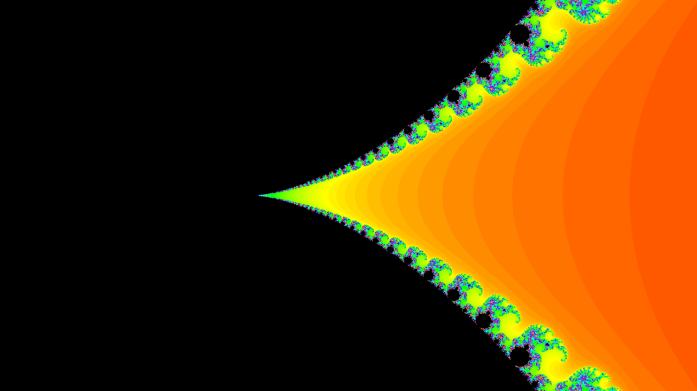

# Mandelbrot Explorer Pro 🌀

.png)

.png)

.png)

.png)

.png)

A high-performance, arbitrary-precision Mandelbrot set explorer built with vanilla JavaScript. This engine utilizes BigInt math to bypass standard 64-bit floating-point limitations, allowing for deep-zoom exploration.

**Live Demo:** [https://bryanhoffman.xyz/mandelbrot_explorer.html](https://bryanhoffman.xyz/mandelbrot_explorer.html)

## ✨ Features

- **Deep Zoom (120-bit Precision):** Uses JavaScript `BigInt` for fixed-point arithmetic, allowing you to zoom far beyond the limits of standard `Number` types.
- **Optimized Rendering:** - **Periodicity Checking:** Detects stable orbits (the "3, 4, 5 glob" states) to exit calculations for interior points early, drastically speeding up the rendering of the main set.
  - **Symmetry Mirroring:** Detects when the view is centered on the X-axis to render only half the pixels and mirror the rest.
  - **Non-Blocking UI:** Uses chunked rendering with `requestAnimationFrame` to keep the browser responsive during heavy calculations.
- **Interactive Exploration:** Click any point on the canvas to center and auto-zoom.
- **Preset Gallery:** Quick-jump to famous locations like Seahorse Valley and Elephant Valley.
- **Export:** Save your discoveries as high-resolution PNGs.

## 🚀 Technical Optimizations

This project implements several classic fractal acceleration techniques:
1. **Fixed-Point Math:** Using `BigInt` bit-shifting (`>> PRECISION_BITS`) to maintain speed while gaining precision.
2. **Orbit Detection:** Implementing a periodicity check every 16 iterations to identify points trapped in the set.
3. **Adaptive Resolution:** A "Step" system allowing for fast draft renders before committing to a high-detail pass.

## 🛠️ Usage

1. Clone the repository.
2. Open `mandelbrot_explorer.html` in any modern browser.
3. Adjust the **Iterations** for more detail or **Quality** for faster movement.
4. Click the canvas to dive deeper into the spirals!

## 📜 License
MIT License - Feel free to use and modify for your own projects.
